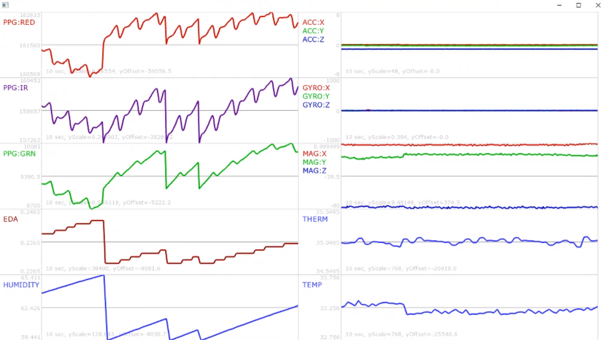

ofxOscilloscope
===============

Multi Oscilloscope addon for openFrameworks.

Allows the user to easily add multiple oscilloscope panels each able to plot multiple data streams.

Includes:
- ofxOscilloscope - addon to plot data

- oscOscilloscopeExample - An example that reads data from an OSC stream and plots it in an oscilloscope window. This example also shows how to use ofxOscilloscopeSettings.xml to reconfigure how the oscilloscope window is displayed without recompiling the code.

Use: place the ofxOscilloscope directory in your openFrameworks addons directory. Then copy the example directories into your myApps folder. 

